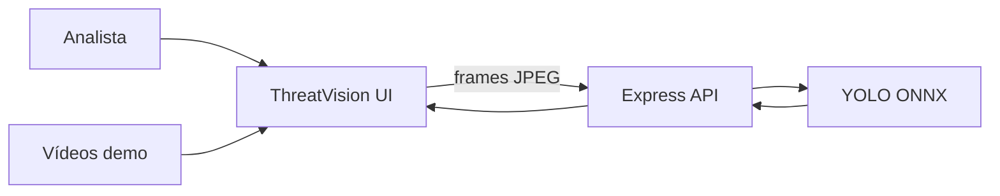

<h1 align="center">ThreatVision Console</h1>

<p align="center">
  <strong>Node.js · Express · YOLO ONNX · Socket.IO · Vercel</strong><br />
  <em>Console tático de visão computacional para detecção de armas, facas e pessoas com máscara em tempo real.</em>
</p>

<p align="center">
  <a href="https://github.com/sidnei-almeida/weapon-threat-detection-console"><strong>Ver no GitHub</strong></a>
</p>

<p align="center">
  
  
  
  
  
  
</p>

---

## O que é

Um **dashboard executivo dark theme** para monitoramento de ameaças com inferência YOLO local. O console transforma detecções do modelo em um fluxo de trabalho de analista: selecionar câmera, acompanhar feed ao vivo com estética CCTV, inspecionar bounding boxes, revisar eventos de alto risco e fazer upload de imagens para análise.

A UI consome a API Express (`/api/*`). Em desenvolvimento local, alertas em tempo real chegam via **Socket.IO**; na Vercel, o feed usa **HTTP** (`POST /api/analyze`).

> **Modelo padrão:** `models/roadvision_yolo_fp32.onnx` — classes `gun`, `knife`, `person_with_mask` (ver `dataset/data.yaml`).

---

## Painéis e fluxo

| Área | Função |
|------|--------|
| **Live Monitor** | Feed de vídeo com overlay CCTV, seleção de câmera, inferência contínua e bounding boxes |
| **Upload Review** | Upload de imagem estática para análise pontual |
| **Incident Queue** | Fila de eventos de alto risco |
| **Analytics** | Tendências de confiança e estatísticas |



---

## Principais recursos

### Monitor ao vivo

- **6 câmeras demo** — vídeos em `public/videos/` servidos como `CAM 01` … `CAM 06`
- **Overlay CCTV** — vignette, scanlines, ruído SVG, glitch e badge REC (puramente visual; não altera o pipeline de inferência)
- **Bounding boxes** — escala correta com `object-fit: contain`, resilientes a resize e zoom
- **Badge de inferência** — taxa aproximada de análise em tempo real

### Detecção e ameaças

- **YOLO local ONNX** — FP32 recomendado; INT8 disponível para experimentos
- **Classes** — `gun`, `knife`, `person_with_mask`
- **Threat scoring** — pesos por classe, bônus de quantidade e contexto (`src/yolo/assessThreat.js`)
- **Níveis de risco** — `critical` · `high` · `medium` · `low` · `none`
- **Backend alternativo** — Roboflow via variáveis de ambiente (útil na Vercel se o cold start do ONNX estourar timeout)

### Boot e identidade visual

- **Loading screen** — boot elegante com warmup do modelo (`/api/warmup`), sincronização de câmeras e barra de progresso
- **Favicon** — escudo + retícula alinhados à marca ThreatVision

### Indicadores de sistema

- Status **Live / Offline** por câmera
- Contadores de incidentes e câmeras online
- Timeline de detecções e painel **THREAT EVENT**

---

## Design system

Pensado para sessões longas de monitoramento: base escura, acento vermelho tático, tipografia mono para dados.

| Elemento | Implementação |
|----------|---------------|
| **Tipografia** | IBM Plex Mono (marca/dados) + Inter (UI) + JetBrains Mono |
| **Paleta** | `#080808` base · `#DC2626` alerta · `#22C55E` live |
| **Feed CCTV** | Filtro `saturate(0.7)` só no display; frames enviados ao YOLO permanecem em cor original |
| **Bounding boxes** | Cores por classe/confiança; cantoneiras táticas nos retângulos |
| **Cards** | Painéis com bordas sutis e hierarquia por zona |

Tokens em `public/css/dashboard.css`.

---

## Severidade e classes

| Classe | Peso no threat score |
|--------|----------------------|
| `gun` | 1.00 |
| `knife` | 0.85 |
| `person_with_mask` | 0.60 |

| Nível | Regra resumida |
|-------|----------------|
| **critical** | 2+ armas com score ≥ 0.75, ou score ≥ 0.85 com 4+ detecções |
| **high** | score ≥ 0.75, ou 3+ armas com score ≥ 0.55 |
| **medium** | score ≥ 0.45, ou 3+ detecções com score ≥ 0.35 |
| **low** | demais detecções |
| **none** | sem detecções |

---

## Stack

| Camada | Escolha |
|--------|---------|
| Runtime | Node.js 20+ |
| Servidor | Express 5 + Socket.IO (local) |
| Inferência | `onnxruntime-node` + modelos ONNX |
| Imagem | Sharp (pré-processamento) |
| Frontend | HTML/CSS/JS vanilla |
| Deploy | Vercel serverless (`api/index.js`) + CDN estática (`public/`) |

---

## Variáveis de ambiente

Copie `.env.example` para `.env`:

```env
PORT=3001
YOLO_MODEL=fp32

# Opcional — Roboflow na Vercel se ONNX falhar por timeout
# DETECTION_BACKEND=roboflow
# ROBOFLOW_API_KEY=
# ROBOFLOW_PROJECT_WEAPON=
# ROBOFLOW_PROJECT_MASK=
```

---

## Quick start

```bash
git clone https://github.com/sidnei-almeida/weapon-threat-detection-console.git
cd weapon-threat-detection-console

npm install
cp .env.example .env

npm run dev
```

Abra [http://localhost:3001](http://localhost:3001).

> **Nota:** A loading screen aguarda o warmup do modelo YOLO. Na primeira requisição após cold start (Vercel), a inferência pode demorar mais.

### Scripts de validação

```bash
npm run inspect:onnx          # metadados + inferência dummy
npm run test:image -- ./images/gun_01_valid.jpg
npm run test:video -- public/videos/demo-test-dataset.mp4
npm run test:threat
npm test                      # integração
```

Imagens de exemplo em `images/` · classes em `dataset/data.yaml`.

---

## Deploy na Vercel

1. Importe o repositório em [vercel.com](https://vercel.com).
2. Framework preset: **Other**
3. Deploy (sem variáveis obrigatórias para YOLO local).

### Assets necessários no repositório

```
public/videos/*.mp4              (~31 MB)
models/roadvision_yolo_fp32.onnx (~38 MB)
```

GitHub aceita arquivos até 100 MB. Para repos mais leves, use [Git LFS](https://git-lfs.com).

### Limitações do plano gratuito

| Item | Detalhe |
|------|---------|
| Timeout | **10 s** por requisição — cold start + modelo pode demorar na 1ª análise |
| Socket.IO | Apenas em **localhost**; na Vercel o feed usa HTTP |
| Histórico | Eventos em memória resetam quando a função serverless reinicia |

Se a inferência falhar por timeout, configure Roboflow nas Environment Variables (ver `.env.example`).

---

## Estrutura do repositório

```
weapon-threat-detection-console/
├── api/
│   └── index.js                 # Entry serverless Vercel
├── public/
│   ├── css/dashboard.css        # Design system
│   ├── js/                      # videoFeed, dashboard, boot, cctvOverlay
│   ├── videos/                  # Câmeras demo (CAM 01–06)
│   └── favicon.svg
├── server/
│   ├── app.js                   # Express app (local + Vercel)
│   ├── index.js                 # Dev server + Socket.IO
│   └── services/                # localYolo, roboflow, threatEngine, videoCameras
├── src/yolo/                    # preprocess, postprocess, assessThreat, loadModel
├── models/                      # ONNX FP32 / INT8
├── dataset/data.yaml            # Classes do modelo
├── scripts/                     # Testes CLI
├── vercel.json
├── readme_model.md              # Referência de estilo para este README
└── .env.example
```

---

## API usada pela UI

| Área | Endpoints |
|------|-----------|
| Sistema | `GET /api/health`, `GET /api/warmup` |
| Inferência | `POST /api/analyze`, `POST /api/analyze/url` |
| Câmeras | `GET /api/cameras` |
| Eventos | `GET /api/events`, `GET /api/events/:id`, `PATCH .../review`, `PATCH .../false-alarm` |
| Stats | `GET /api/stats`, `GET /api/confidence-trend` |

---

## Aviso

Detecções do modelo e scores de ameaça são para **demonstração e monitoramento analítico apenas**. Não constituem aconselhamento de segurança operacional nem substituem protocolos oficiais de resposta a incidentes. Sempre valide alertas com fontes primárias e equipes humanas.

---

## Licença e autor

**MIT License**

**Sidnei Alves de Almeida** — [@sidnei-almeida](https://github.com/sidnei-almeida)
